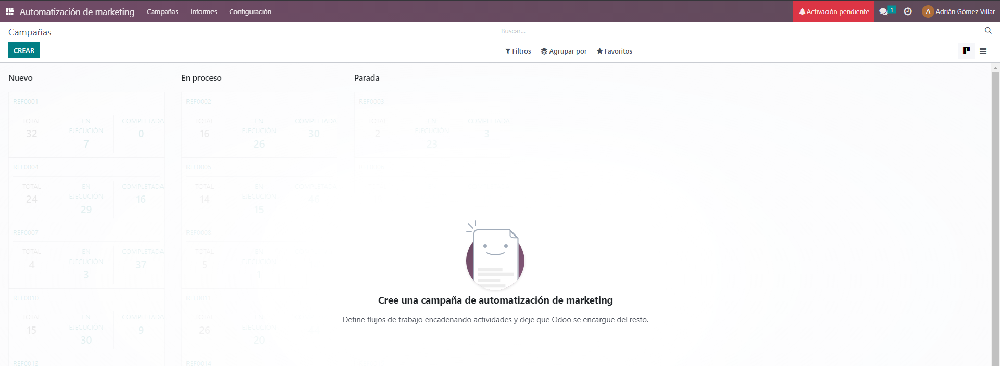
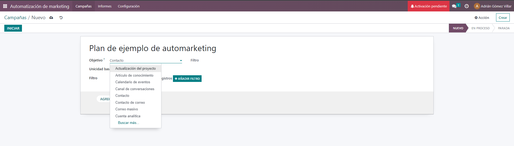
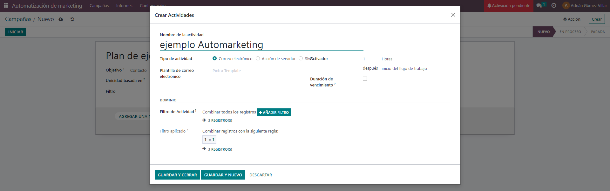
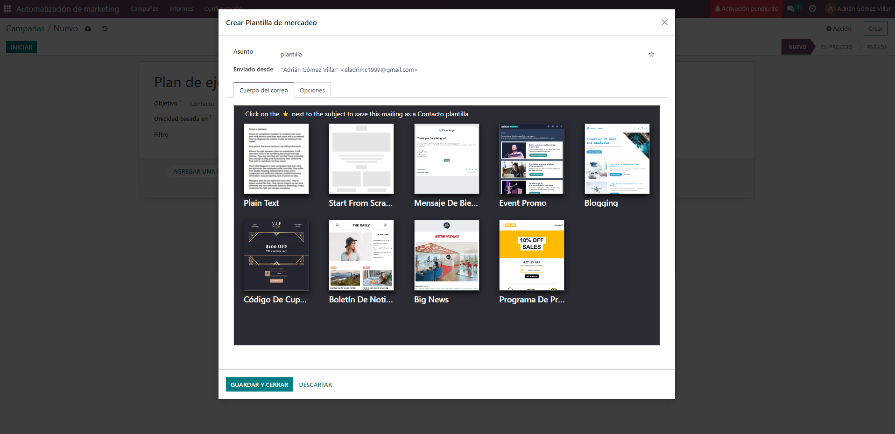
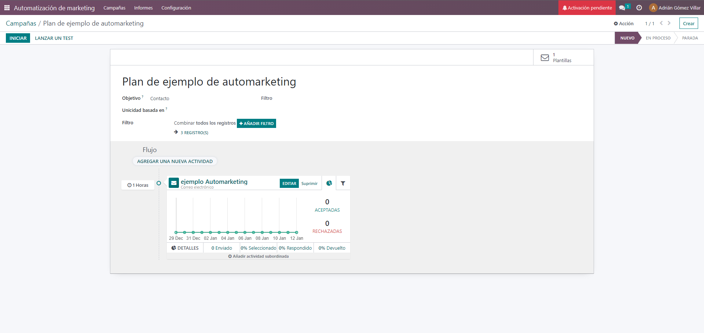
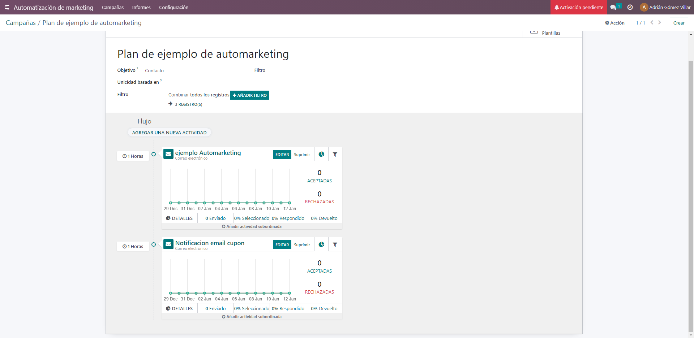
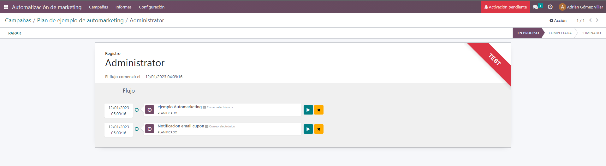

El módulo de automatización de marketing en Odoo es una herramienta que te permite programar y automatizar campañas de marketing en base a un flujo previamente configurado y segmentando tus destinatarios. Con este módulo, puedes crear campañas personalizadas y automatizadas, programarlas para que se envíen en un momento específico y seguir los resultados en tiempo real.
Entre las características principales del módulo de automatización de marketing de Odoo se incluyen:
•	Crear campañas de marketing automatizadas personalizadas y segmentadas utilizando la información de tus clientes y contactos.
•	Configurar un flujo de campaña con ramificaciones y acciones para personalizar la comunicación.
•	Programar el envío de los mensajes en un momento específico.
•	Seguir los resultados de las campañas en tiempo real, incluyendo estadísticas.
Para poder empezar a usar este modulo seguiremos este tutorial sobre el módulo de automatización de marketing en Odoo, te proporciono los siguientes pasos:
1.	Asegúrate de tener acceso al módulo de automatización de marketing en tu instancia de Odoo. Si no lo tienes, puedes comprarlo en la tienda de aplicaciones de Odoo o contactar a un desarrollador para que te lo instale.
2.	Accede a la pestaña de "Aplicaciones" en el menú principal de Odoo y selecciona "Marketing Automation" en el submenú.

3.	Haz clic en el botón "Crear" para crear una nueva automatización de marketing, podemos tener diferentes objetivos para diferentes campañas, desde promocionar un nuevo producto hasta hacer conocer una nueva marca o dar información sobre actualizaciones de un producto.

4.	Utiliza los filtros para seleccionar los destinatarios de la automatización, ya sea seleccionando una lista de correos específica, clientes de una categoría específica, o todos los contactos de tu base de datos, podremos elegir el método de contacto, por email, sms o acción de  servidor, que podría usarse para mandar una notificación push al  móvil de los usuarios a través de una app, como por ejemplo los supermercados mandan notificaciones sobre nuevos cupones.

5.	Al seleccionar una plantilla si no hay ninguna creada nos abre esta ventana para crear una plantilla de correo.

6.	Utiliza las reglas y acciones para configurar el flujo de la automatización. Puedes establecer ramificaciones en el flujo para personalizar la comunicación con los destinatarios.

7.	Crea los mensajes y contenido que se enviarán en cada etapa de la automatización, puedes incluir diferentes medios de comunicación como correos electrónicos, SMS, notificaciones web, entre otros (Se  realizan de la misma  forma que en el punto 4).
8.	Al añadir diferentes actividades veremos las estadísticas de las mismas en el flujo del plan, como en este caso es via email salen graficas de emails aceptados o rechazados.

9.	Configura los detalles de la programación de la automatización, incluyendo fecha y hora de inicio y finalización.
10.	Haz clic en el botón "Iniciar" para iniciar la automatización. Puedes seguir el progreso de la automatización en tiempo real utilizando las estadísticas y el seguimiento de resultados.
11.	Podemos también lanzar tests durante la duración de  la campaña, tanto a un usuario particular como prueba como a diferentes grupos.

12.	Una vez completada la automatización, es importante analizar los resultados y sacar conclusiones para mejorar en las siguientes automatizaciones.
13.	Utiliza los informes y estadísticas del módulo para analizar el rendimiento de la automatización, como la tasa de apertura y clics, y utiliza esta información para optimizar tus próximas automatizaciones.
14.	Personaliza las acciones de acuerdo al comportamiento de tus destinatarios, por ejemplo, enviar un mensaje específico a quienes han abierto un correo previo o dirigir un flujo especial a destinatarios que han realizado una acción específica en una etapa previa.
15.	Utiliza las funciones de segmentación para crear grupos específicos de destinatarios y personalizar las acciones para cada uno de ellos, esto te permitirá crear automatizaciones más efectivas.
16.	En caso de usar medios de comunicación que requieran de una licencia y pago, asegúrate de tener una licencia de mensajería y saldo suficiente para enviar los mensajes. Asimismo debes asegurarte de cumplir las leyes y regulaciones del país donde se envían los mensajes.
Con estos pasos, deberías tener una buena comprensión de cómo utilizar el módulo de automatización de marketing en Odoo. Siempre recuerda que la monitorización y análisis de resultados son esenciales para mejorar tus automatizaciones de marketing en el futuro.
