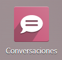
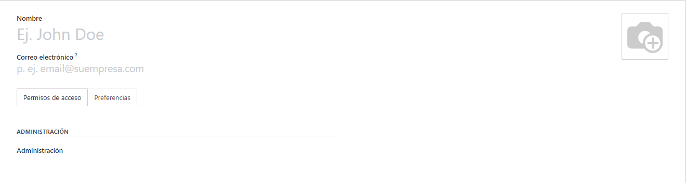
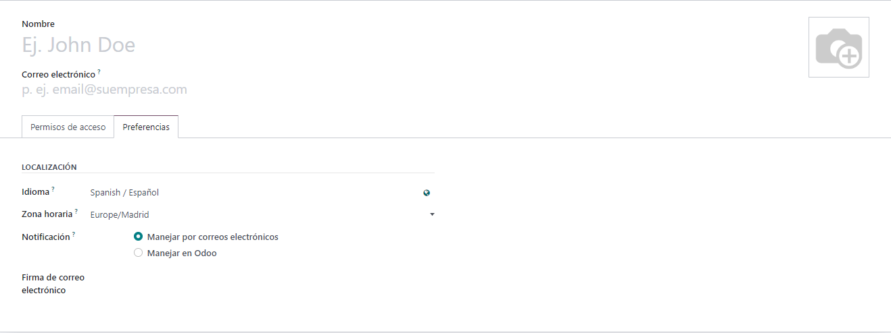
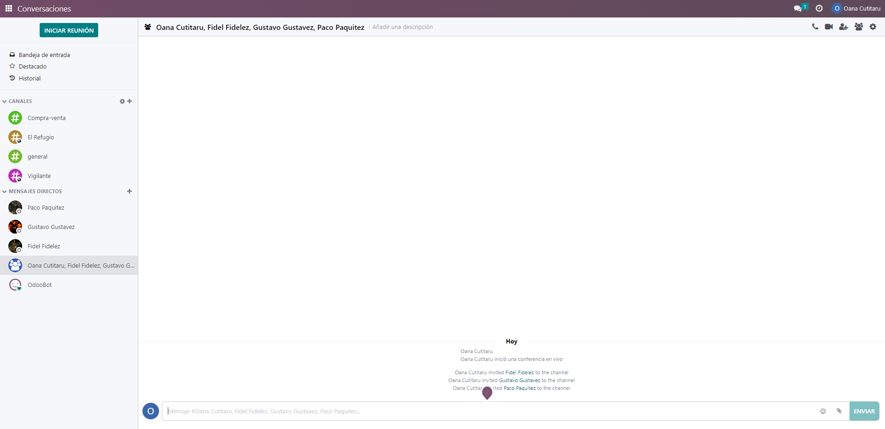

# Conversaciones

## **ÍNDICE DE CONTENIDOS**
1. [INTRODUCCIÓN](#introducción)
2. [INSTALACIÓN](#instalación)
3. [TRABAJAR CON LA APLICACIÓN](#trabajar-con-la-aplicación)
   1. [Cómo funciona conversaciones](#cómo-funciona-conversaciones)
   2. [Menú configuración](#menú-configuración)
   3. [Gestión de almacenes](#gestión-de-almacenes)
   4. [Gestión de ubicaciones](#gestión-de-ubicaciones)
   5. [Crear una categoría de productos](#crear-una-categoría-de-productos)
   6. [Crear un nuevo producto ](#crear-un-nuevo-producto)
   7. [Crear una regla de abastecimiento](#crear-una-regla-de-abastecimiento)
   8. [Generar informes y exportar datos](#generar-informes-y-exportar-datos)
   9. [Relación entre aplicación Inventario - Compras - Ventas](#relación-entre-aplicación-inventario---compras---ventas)
   10. [Conclusión](#conclusión)
## Introducción
La aplicación Conversaciones es una herramienta de comunicación que sirve para que todos los integrantes de un equipo estén en contacto.

Con esta herramienta se puede no sólo estar en contacto con los distintos integrantes de una empresa sino que también se puede obtener un resumen de todos los temas que se discuten e información de nuevos mensajes en el boletín que está a disposición del usuario.

## Instalación
Esta aplicación no hay que instalarla pues ya viene preinstalada en Odoo, por lo que es gratuita e ilimitada en cuanto a número de usuarios.

## Trabajar con la aplicación
Para poder darle uso, lo primero que se necesita es tener usuarios, cada uno representa a un empleado por lo que cada uno de ellos debe tener su información propia como empleado, tal como nombre, apellidos, correo electrónico, fotografía, qué permisos se le tiene que dar:

(control espacio para añadir imágenes)

E incluso preferencias de idioma y zona horaria, entre otros.

Una vez tengamos los usuarios, tiene sentido acceder a la pantalla de conversaciones y nos encontramos con la siguiente pantalla:

### Cómo funciona Conversaciones