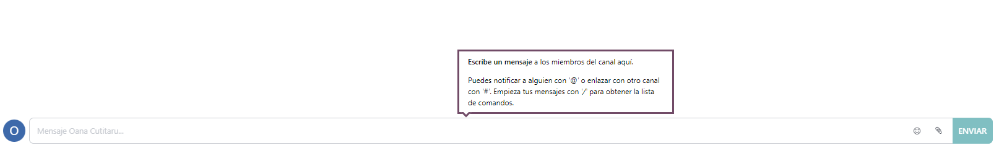

# Conversaciones

## **ÍNDICE DE CONTENIDOS**
- [Conversaciones](#conversaciones)
  - [**ÍNDICE DE CONTENIDOS**](#índice-de-contenidos)
  - [**Introducción**](#introducción)
  - [**Instalación**](#instalación)
  - [**Trabajar con la aplicación**](#trabajar-con-la-aplicación)
    - [*Crear empleados*](#crear-empleados)
    - [*Iniciar una reunión*](#iniciar-una-reunión)
    - [*Crear canales*](#crear-canales)
    - [*Usar un canal*](#usar-un-canal)
  - [**Conclusión**](#conclusión)

## **Introducción**

La aplicación Conversaciones es una herramienta de comunicación que sirve para que todos los integrantes de un equipo estén en contacto mediante mensajes, notas y chat.

Con esta herramienta se puede no sólo estar en contacto con los distintos integrantes de una empresa sino que también se puede obtener un resumen de todos los temas que se discuten e información de nuevos mensajes en el boletín que está a disposición del usuario. Asimismo, es posible compartir proyectos y archivos con los distintos miembros para que todos tengan acceso a la información que necesiten.

## **Instalación**
Esta aplicación no hay que instalarla pues ya viene preinstalada en Odoo, por lo que es gratuita e ilimitada en cuanto a número de usuarios.

## **Trabajar con la aplicación**
### *Crear empleados*
Para poder darle uso, lo primero que se necesita es tener usuarios. Cada uno representa a un empleado por lo que cada uno de ellos debe tener su información propia como empleado, tal como nombre, apellidos, correo electrónico, fotografía, qué permisos se le tiene que dar:

En preferencias se puede elegir el idioma y zona horaria, y cómo quiere manejar sus notificaciones, que aparece marcado de forma predeterminada como 'Manejar por correos electrónicos'. Con esta opción, se le envían al usuario mediante correo electrónico aquellos mensajes y notificaciones donde se le menciona o que dicho usuario sigue.

Una vez tengamos los usuarios, accedemos a la aplicación de conversaciones y nos encontramos con la siguiente pantalla:

---

### *Iniciar una reunión*

Un usuario puede iniciar una reunión simplemente pulsando el botón ***`iniciar reunión`*** situado arriba a la izquierda. De esta forma se abre la siguiente pantalla:

Aquí el usuario puede seleccionar a la derecha a los miembros de la empresa con los que quiera iniciar una conversación. La reunión puede mantenerse por llamada (usando únicamente la voz), por videollamada (usando imagen y voz) y escribiendo en el recuadro situado en la zona inferior de la pantalla. Cada usuario tiene una imagen propia, que como se vio anteriormente puede personalizar a su gusto, para distinguir a los distintos empleados que puedan participar en la reunión.

Una flecha morada situada en la parte baja de la pantalla, justo encima del recuadro donde se permite escribir, va a indicar al usuario distintos consejos. Las indicaciones que da es sobre qué opciones tiene el usuario a su alcance, como por ejemplo nombrar a un usuario, nombrar un canal, o ver los distintos comandos.

Como se puede observar, en las reuniones pueden participar dos o más personas, pues se permiten las conversaciones grupales.

---

### *Crear canales*

En Conversaciones el administrador puede crear distintos canales e indicar los miembros que pertenecen a cada uno de ellos. También es posible añadir una descripción de cada canal, aunque es algo totalmente opcional.

Esto es especialmente útil para agrupar a los empleados en distintos grupos, pudiendo un empleado estar en ninguno, uno o varios canales. De esta manera se evita duplicar información y cada empleado tendrá acceso únicamente a lo que es de su interés y de su incumbencia.

---

### *Usar un canal*

Para usar un canal simplemente se tiene que pinchar en el canal donde se quiera escribir, en la lista de canales de la parte izquierda de la pantalla. En la aplicación Conversaciones, el canal ***`general`*** se crea automáticamente y el bot de Odoo, llamado `OdooBot` inicia la conversación. Aquí estarán todos los empleados de una empresa, útil para dar avisos que incumban a todos, como noticias acerca de los logros de la empresa, por ejemplo.

A la hora de usar un canal, se puede simplemente escribir, como el ejemplo de la imagen, se puede adjuntar un archivo pulsando en el símbolo del clip, en la caja de abajo y usar emoticonos, en la misma caja.

Asimismo, arriba a la derecha hay un menú que permite iniciar una llamada, una videollamada, añadir un usuario, ver la lista de empleados que tienen acceso al canal, y configurar una llamada.

En la configuración de voz se puede elegir el dispositivo de entrada, pulsar una tecla para hablar, algo especialmente útil si no quieres tener el micro abierto todo el rato, y ajustar la detección de voz.

En la configuración de vídeo se puede elegir ver sólo los participantes con vídeo y difuminar el fondo, si así se desea para tener algo de privacidad.

## **Conclusión**

Las conversaciones son especialmente útiles para permitir que los distintos empleados que forman parte de una empresa puedan estar en contacto, tal y como se ha indicado. El hecho de que se pueda agrupar a los distintos usuarios es especialmente útil para evitar que por ejemplo alguien de márketing tenga acceso a datos de facturación, sino que cada uno estará en su propio grupo. Bien es cierto que hay aplicaciones gratuitas que ya permiten esto, como es el caso de `Microsoft Teams`, también es verdad que hay quien prefiere tenerlo todo en un mismo espacio, trabajar únicamente desde Odoo sin necesidad de abrir otra aplicación, pues así está más a mano.