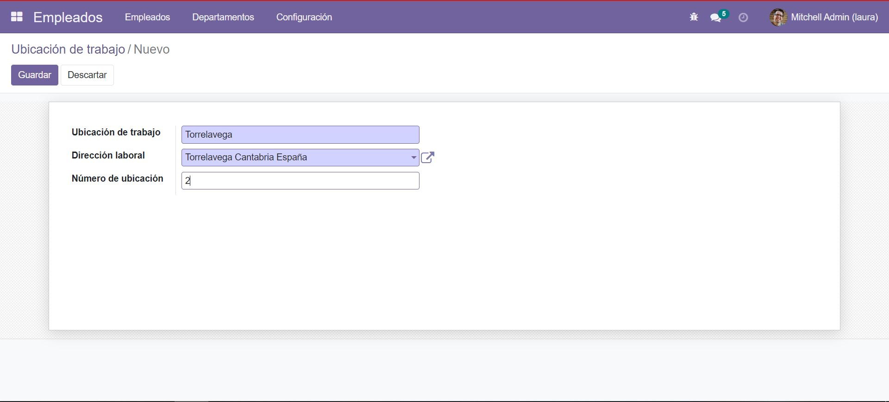

# APLICACIÓN EMPLEADO

## **ÍNDICE DE CONTENIDOS**
- [Introducción](#introducción)
- [Intalación](#instalación)
- [Resumen funcionalidad y utilidades comunes](#resumen-funcionalidad-y-utilidades-generales)
- [Apartados del módulo](#apartados-del-módulo)
    
   - [Apartado empleados](#apartado-empleados)
       - [Creación y acceso ficha información empleado](#1--creación-y-acceso-ficha-información-empleado)
       - [Acciones sobre empleados](#2--acciones-sobre-empleados)
       - [Creación lanzamiento de plan](#3-lanzamientocreación-de-planes-por-empleado)
    
    - [Apartado departamentos](#apartado-departamentos)
       

    - [Apartado menú configuración](#apartado-configuración)
        - [Ajustes](#1-ajustes)
        - [Puestos de trabajo](#2-puestos-de-trabajo)
       
        - [Etiquetas](#3-etiquetas)
        - [Departamentos](#4-departamentos)
        - [Ubicación de trabajo](#5-ubicación-de-trabajo)
        - [Motivos de salida](#6-motivos-de-salida)
        - [Tipos de planeación](#7-tipos-de-planeación)
        - [Planes](#8-planes)

---   
## **INTRODUCCIÓN**
---

Una empresa necesita gestionar sus empleados y tener toda la información de recursos humanos a rápida disposición.

Las opciones de la que dispondremos con el módulo de empleados son:

- Supervisar la información importante por departamento.
- Limitar la visibilidad de la información sensible.
- Recibir alertas sobre nuevas solicitudes de permisos.
- Asignar puestos, postulaciones, evaluaciones...
- Registra el tiempo y la asistencia.
- Gestión de permisos de empleados.
- Gestión de gastos agilizada.
- Evaluación de empleados fácil.
- Agiliza la contratación de empleados. 
- Aumenta la interacción con herramientas sociales.

Para más información sobre sus múltiples utilidades no olvides visitar: https://www.odoo.com/es_ES/app/employees

---
## **INSTALACIÓN**
---

Hay que recordar que podemos instalar este módulo desde dos modos:
- El modo desarrollador. 
- El modo por defecto. 

Desde el primero podremos obtener más información y permisos sobre las instalaciones y desarrollos y por el contrario con el segundo obtendremos sólo la información básica.

**Para descargar el módulo los pasos a seguir son:**

- Acceder al apartado "Aplicaciones".

- En el buscador introducir el nombre del módulo "Empleados".

- *`(De forma opcional)`* Para obtener más información sobre el módulo, pinchar sobre "…". 

- Y por último pinchar en "Instalar". 

---
## **RESUMEN FUNCIONALIDAD Y UTILIDADES GENERALES**
---
#### **FUNCIONALIDAD DEL MÓDULO** 

El módulo ayuda a coordinar y gestionar a cada [empleado](#apartado-empleados) y los distintos [departamentos](#apartado-departamentos) de la empresa y algunas [configuraciones básicas](#apartado-configuración). 

Las opciones son múltiples, desde la creación del perfil de los distintos empleados, hasta la gestión de las operaciones relacionadas con los contratos.

Podremos resumir su función de la siguiente manera: ayudar y dar soporte al departamento de Recursos Humanos de cada empresa.

#### **SECCIÓN ACTIVIDAD**

 Nos muestra la actividad reciente en las secciones "Empleados", "Departamentos", "Puestos de trabajo", y en todos aquellos formularios sobre los cuales podamos crear y realizar acciones de archivado, suprimido y duplicado. Todas estas acciones se almacenaran en esta sección, junto con la fecha y hora de la interacción. También observamos que se pueden añadir adjuntos, dejar mensajes personalizados, añadir notas o seguidores, o simplemente seguir un departamento, empleado o puesto que nos interese. De estos nos llegaran todas las notificaciones referentes a la sección de actividad.

 **`EJEMPLOS ASPECTO SECCIÓN DE ACTIVIDAD`**

---
## **APARTADOS DEL MÓDULO**

---
### -> **APARTADO EMPLEADOS**
---
#### **1.- Creación y acceso ficha información empleado**

Para insertar un nuevo usuario debemos pinchar sobre el botón "Crear", y este nos llevará al siguiente formulario: 

Como podemos ver en la imagen, el formulario contiene la información básica del empleado: puesto, nombre, etc. y tres pestañas adiccionales donde se gestionarán otros datos.

Completamos los datos que nos puedan interesar y creamos.

*`Podemos observar que una vez creado se muestra la ficha de empleado. Una notificación en el lado de actividad nos informará de la fecha y creación de este, junto con otras opciones que explicaremos más adelante.`*

Esta ficha se almacenará junto al resto, en esta misma sección, y se accederá pinchando sobre el usuario deseado:

 Tras seleccionar al empleado que nos interese nos mostrará el siguiente formulario: 

 `TODOS LOS FORMULARIOS TIENEN LA OPCIÓN DE EDITAR SUS CAMPOS.`

  1. Información del trabajo
    
    Nos muestra un breve resumen sobre la información de usuario en cuanto a su trabajo se refiere.

  2. Información privada
  
    Nos muestra toda la información de contacto y datos bancarios asociados al usuario.

  3. Configuración de RRHH  
 
    Muestra la información referente al usuario y recursos humanos.

#### **2.- Acciones sobre empleados**

Accediendo a la ficha de empleados explicada en [el anterior punto](#1--creación-y-acceso-ficha-información-empleado) y pinchando sobre el botón "Acción", obtendremos las siguientes funcionalidades: 

1. Archivar o desarchivar un empleado: 

En caso de baja, despido, renuncia, etc nos dejará la ficha almacenada y dispondremos de las siguientes opciones: 

2. Duplicar la ficha de un empleado: 

Podremos crear y modificar una copia de la ficha de un empleado.

3. Eliminar la ficha del empleado: 

Esta opción simplemente elimina el registro.

` TODA ACCIÓN SOBRE LOS EMPLEADOS APARECERÁ REFLEJADA Y ALMACENADA CON FECHA Y HORA A LA DERECHA, EN LA SECCIÓN DE ACTIVIDAD EXPLICADA` [AQUÍ](#sección-actividad)`.`

`LA SECCIÓN DE ACTIVIDAD DE ESTE APARTADO TIENE LA SIGUIENTE APARIENCIA:`

#### **3.-Lanzamiento/creación de planes por empleado**

Accediendo a la ficha de empleados explicada  [aquí](#1--creación-y-acceso-ficha-información-empleado) podremos gestionar la creación de planes y su asignación al empleado.

A la creación de planes también se podrá acceder desde el apartado ["Configuración"-> "Tipos de planeación"](#7-tipos-de-planeación).

---
**`OTROS DATOS DE INTERÉS`**

---

`TAMBIÉN DISPONE DE LA OPCIÓN DE DESCARGAR UN` ["EXCEL"](imagenes_empleado/hr_employee.xls) `CON TODOS LOS EMPLEADOS`

---
### -> **APARTADO DEPARTAMENTOS**
---

Nos permite organizar y gestionar los distintos departamentos o secciones de nuestra empresa.
En la creación de departamentos podremos asignar el nombre, y el departamento padre y gerente si fuera necesario.

Una vez creado el nuevo departamento, se almacenará en esta sección. Contiene un buscador, filtros, opciones de agrupación y favoritos. También se permite la modificación de su apariencia con colores.

Pinchando sobre el departamento deseado tendremos el botón "Acción" con su correspondiente menú desplegable:

- **Archivar/Desarchivar:**
  con **Archivar**, se nos mostrará distintas opciones por las cuales un departamento puede ser archivado. De archivarse, este dejará de estar en la sección de actualidad, y su uso pasará a estar restringido. 

  

  Con **Desarchivar**, el departamento vuelve a estar disponible y para uso.

   

- **Duplicar:** nos permite hacer un duplicado de la ficha de un departamento.

- **Suprimir:** borra el departamento permanentemente de la lista de departamentos.

---
**`OTROS DATOS DE INTERÉS`**

---

**`- DISPONE TAMBIÉN DE `[LA SECCIÓN ACTIVIDAD](#sección-actividad)**

**`- DISPONDREMOS DE LA OPCIÓN DE ORGANIZAR POR COLUMNAS O GESTIONAR SU VISUALIZACIÓN EN LA PANTALLA PRINCIPAL DE EMPLEADOS PINCHANDO SOBRE "+", ASÍ COMO LA OPCIÓN DE AÑADIR NUEVAS COLUMNAS DESDE ESTA MISMA PANTALLA: `**

---
### -> **APARTADO CONFIGURACIÓN**
---
#### **1. Ajustes** 

 Nos encontramos ante una de las opciones más versátiles y completas del módulo. Desde esta podremos gestionar:
  
  - OPCIONES GENERALES (Que dispone de los siguientes apartados):

        Usuarios
        Idiomas
        Empresas
        Conversaciones
        Contactos
        Permisos
        Integraciones
        Rendimiento
        Herramientas de desarrollador
    

    

  - EMPLEADOS (Que dispone de los siguientes apartados):

        Empleados
        Organización de trabajo
        Derechos de actualización del empleado
     
    

#### **2.	Puestos de trabajo**
Esta sección es la encargada de gestionar los puestos de trabajo de nuestra empresa, permitiendo crear nuevos puestos así como su modificación o incluso la eliminación de los ya existentes. También podremos optar a la descarga de un "Excel" con las hojas de los puestos.

-	**Presentación**: Nos encontramos la siguiente tabla:

-	Dispone de buscadores, con opción a filtros, agrupación y favoritos.
Una vez creado el nuevo puesto se accederá a ellos desde el apartado "Configuración", pulsando "Puesto de trabajo". Seleccionando el deseado, se abrirá la ficha mostrando las opciones. Se puede detener o activar el estado de reclutamiento, permitiendo la búsqueda de futuros empleados.

---
**`OTROS DATOS DE INTERÉS`**

---

`Mediante el botón "Acción" nos permite duplicar o suprimir un puesto.`

`Contiene la sección de` [actividad](#sección-actividad)`.`

`Contiene la opción para exportar un Excel con los datos de los puestos de trabajo`

`Nos descargara `[un archivo como este](imagenes_empleado/Puesto%20de%20trabajo%20(hr.job).xlsx)`.`

#### **3.	Etiquetas**
Permite gestionar las subetiquetas de los puestos. Mediante ello añadimos subcategorías a los puestos.

#### **4.	Departamentos**
Funcionalidad explicada [aquí](#apartato-departamentos).

#### **5.	Ubicación de trabajo**
Nos permite gestionar de forma múltiple o individual las sedes o direcciones de un trabajo, pudiendo crear o eliminar estas, siempre que quisiéramos.
El formulario es bastante básico y de rápido acceso, encontrando solamente la ubicación del trabajo, la dirección laboral y el número de esta.
Una vez creada la ficha, se podrá visualizar desde Ubicaciones de trabajo. Se selecciona la ubicación sobre la cual queramos realizar cambios y nos permitirá el archivado, la duplicación y la supresión del elemento en cuestión.

               

#### **6.	Motivos de salida**

Contiene motivos por defecto y opción a añadir más.

Vamos a mostrar un caso creación y utilización:

Y ahora, por ejemplo, volviendo a la ficha de 
Empleados, vamos a archivar al empleado Abigail por Desaparición (opción personalizada).

 Como podemos observar, al archivar en motivos de salida, ya se incluye Desaparición. Editamos y estará listo en la ficha técnica de Abigail.

#### **7.	Tipos de planeación**

Gestión de los tipos de planeación de empresa.
Encontraremos el formulario donde se especificará el tipo de actividad, el resumen, el responsable y la notas que deseamos introducir.
A las fichas de planes se accederá desde la sección Tipos de planeación. Para acceder a las opciones de duplicado y supresión, se debe pinchar en el botón "Acción".
Estos planes se pueden utilizar como ya hemos visto en la sección de "Empleados", "Lanzar plan".

#### **8.	Planes**
Gestiona y ofrece todos los modelos de planeación, pudiendo crear una tabla con el nombre del plan específico e ir adjuntando subplanes. Es decir, nos encontramos ante una tabla de objetivos.
Al seleccionar "Planes", tendremos las fichas existentes con la posibilidad de creación, edición, duplicación y supresión.

   