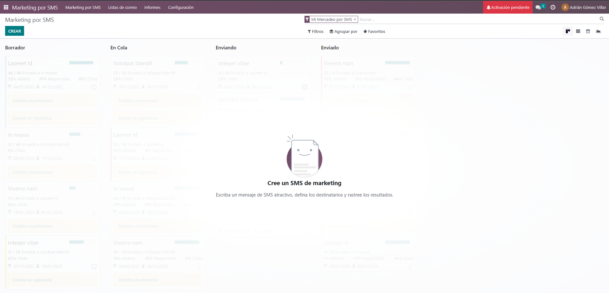
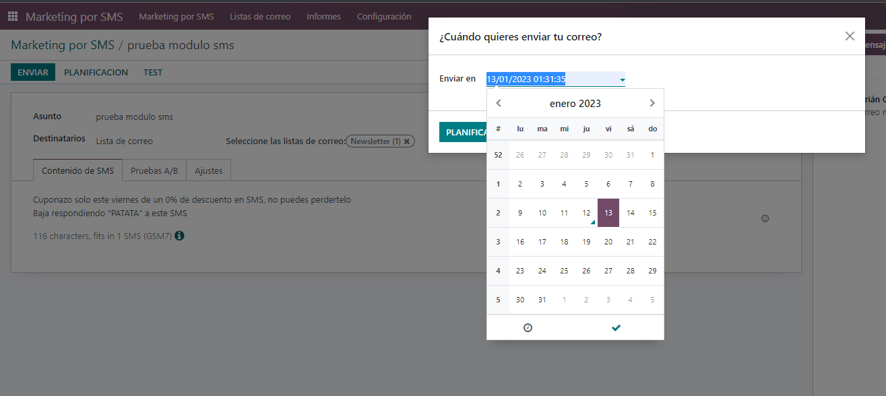

El módulo de marketing por SMS de Odoo es una herramienta que te permite enviar mensajes de texto a tus contactos o clientes utilizando la plataforma de Odoo. Con este módulo, puedes crear campañas de marketing SMS personalizadas y segmentadas, programarlas para enviarse en un momento específico, y seguir los resultados en tiempo real.
Entre las características principales del módulo de marketing por SMS de Odoo se incluyen:
•	Crear campañas de marketing SMS personalizadas y segmentadas utilizando la información de tus clientes y contactos.
•	Programar el envío de los mensajes en un momento específico.
•	Seguir los resultados de las campañas en tiempo real, incluyendo estadísticas de entrega, apertura y respuestas.
•	Personalizar los mensajes con información de tus clientes, como su nombre.
•	Integración con otros módulos de Odoo, como CRM o Punto de Venta, para una mejor segmentación y personalización.
Con este módulo, podrás enviar campañas masivas de SMS, y segmentarlas según distintos criterios, ya sea una lista de correos, una categoría de clientes, entre otros. Asimismo se podra programar cuando enviar los mensajes y monitorear su entrega, apertura y respuestas.
Para comenzar a usar el módulo de marketing por SMS en Odoo, sigue los siguientes pasos:
1.	Accede a tu instancia de Odoo y asegúrate de tener acceso al módulo de marketing SMS. Puedes comprarlo en la tienda de aplicaciones de Odoo o contactar a un desarrollador para que te lo personalice.
2.	Una vez que tengas acceso al módulo, ve a la pestaña "Aplicaciones" en el menú principal de Odoo y selecciona "Marketing" en el submenú.

3.	Haz clic en el botón "Crear" para crear una nueva campaña de marketing SMS.

4.	Selecciona los destinatarios de la campaña mediante el uso de filtros. Puedes seleccionar a los contactos de una lista de correo específica, a los clientes de una categoría específica o a todos los contactos de tu base de datos. También puedes importar una lista de contactos desde un archivo CSV.
5.	Escribir el mensaje SMS que deseas enviar a tus destinatarios. Asegúrate de mantenerlo corto y conciso. Asegurate de cumplir con las regulaciones de envio de SMS, incluyendo la no inclusión de contenido malicioso o ilegal, o la necesidad de incluir una opcion para darse de baja en el mensaje.
6.	Configura los detalles de la programación de la campaña, incluyendo la fecha y hora de inicio y finalización de la campaña. Puedes programar varios mensajes y en diferentes horarios y fechas.

7.	Haz clic en el botón "Enviar" para iniciar la campaña de marketing SMS. Puedes seguir el progreso de la campaña en tiempo real mediante el uso de las estadísticas y el seguimiento de resultados, ademas de ver los reportes de entrega, apertura, respuestas, etc.
8.	En este caso sale un error ya que no tenemos una cuenta registrada para enviar SMS

9.	Una vez completada la campaña, es importante analizar los resultados y sacar conclusiones para mejorar en las siguientes campañas. Puedes ver que mensajes funcionaron mejor, a que horas y fechas se obtuvo una mayor apertura, que mensajes dieron mejores respuestas, entre otros.
10.	Ahora, para próximas campañas, puedes reutilizar los mensajes y segmentos de contactos que hayan dado buenos resultados, así como también ir mejorando en la programación y segmentación de la campaña.
11.	Antes de enviar la campaña, es recomendable realizar una prueba de envío a un pequeño grupo de contactos para asegurarte de que todo está configurado correctamente y que el mensaje se ve y se recibe de la manera deseada.
12.	Puedes agregar una variación de personalización en los mensajes, como el nombre del destinatario, para hacerlos más atractivos y personalizados.
13.	Si tu instancia de Odoo está integrada con otros módulos, como el CRM o el Punto de Venta, puedes utilizar la información de tus clientes para segmentar y personalizar tus campañas de marketing SMS, según su historial de compras o comportamiento en el sitio web.
14.	Puedes utilizar una función de seguimiento de resultados para medir el éxito de tus campañas de marketing SMS. Esta función te permite ver cuántos mensajes fueron entregados, cuántos fueron abiertos y cuántos generaron una respuesta. Esta información te ayudará a mejorar tus campañas en el futuro.
15.	Es importante cumplir con las regulaciones de envío de SMS, incluyendo la no inclusión de contenido malicioso o ilegal, o la necesidad de incluir una opción para darse de baja en el mensaje. Asegúrate de tener los permisos necesarios y de no enviar mensajes a contactos que no hayan dado su consentimiento para recibir mensajes.

Con estos pasos deberías tener una buena comprensión de cómo utilizar el módulo de marketing por SMS en Odoo. Siempre recuerda que el monitoreo y análisis de resultados son clave para mejorar tus campañas en el futuro.
Nota: Asegúrate de tener una licencia de mensajería y tener saldo suficiente para enviar los mensajes. Tambien debes asegurarte de cumplir las leyes y regulaciones del pais donde se envian los mensajes.
