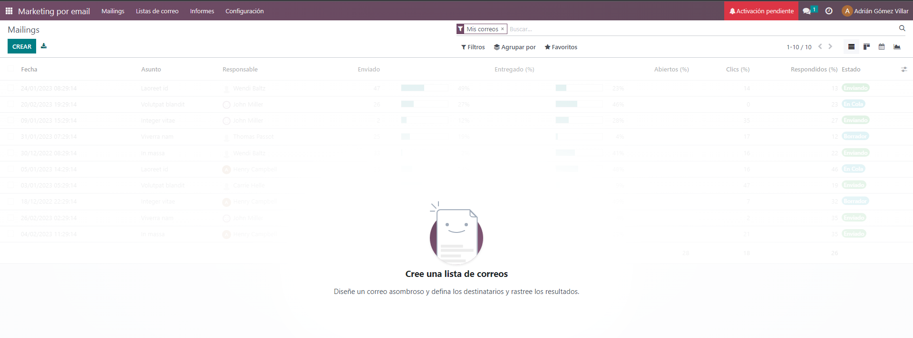
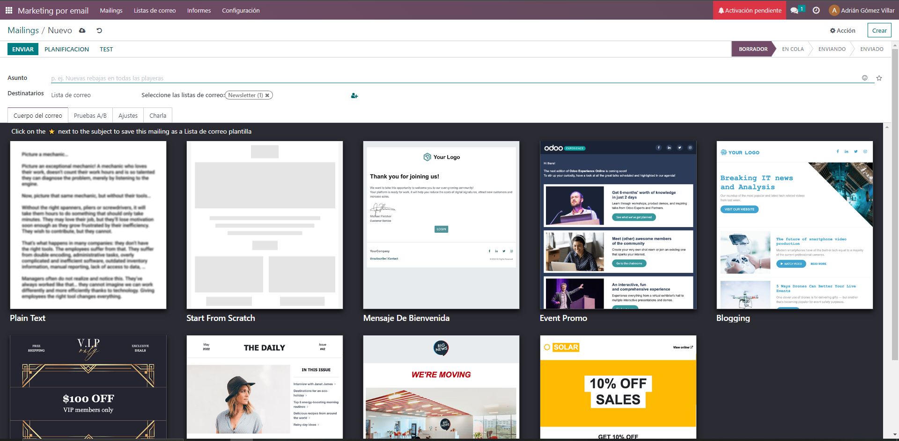
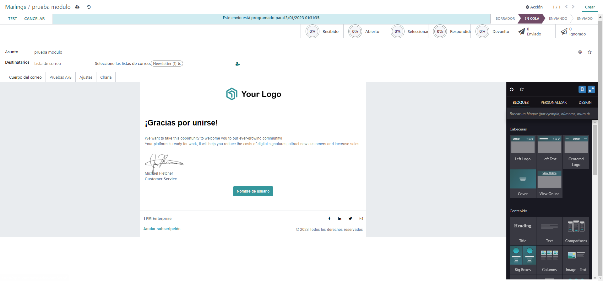
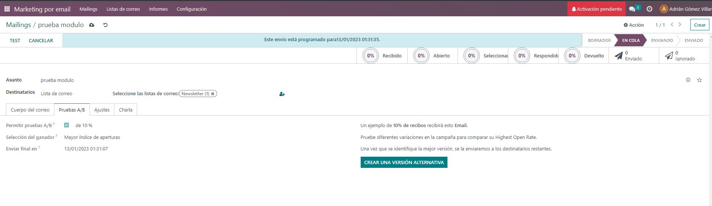
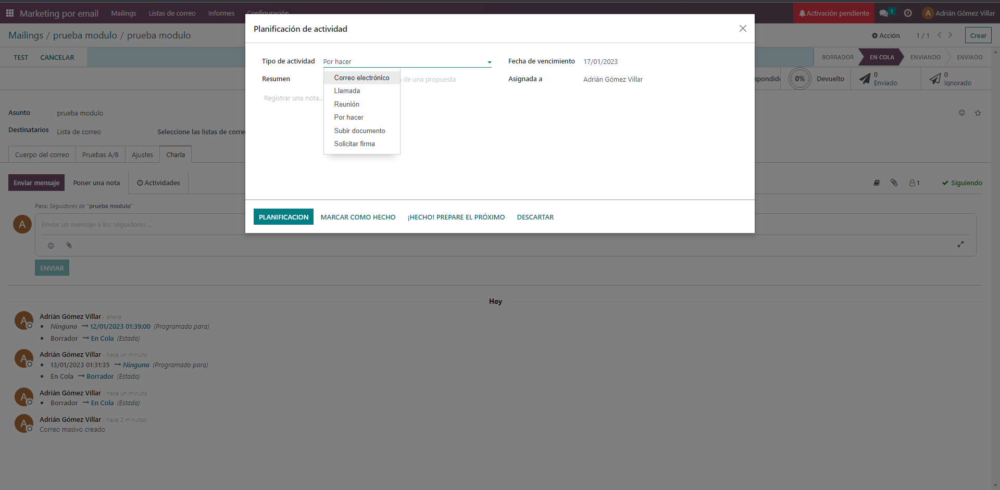
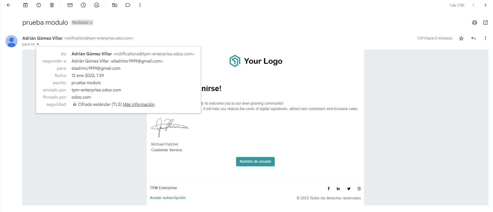

El módulo de marketing por correo electrónico de Odoo es una herramienta que permite a las empresas crear, gestionar y realizar seguimiento a campañas de correo electrónico masivo. Con este módulo, puedes crear correos electrónicos personalizados y enviarlos a una lista de correo específica, con el objetivo de promocionar tus productos o servicios, fomentar el engagement con tus clientes o simplemente mantenerlos informados sobre las novedades de tu empresa.
A continuación se explica cómo utilizar el módulo de marketing por correo electrónico en Odoo.

1.	Inicie sesión en su cuenta de Odoo y vaya a la aplicación de Marketing. Una vez dentro, podrás ver diferentes opciones para crear y gestionar campañas de correo electrónico.

2.	Haga clic en "Crear" para crear una nueva campaña de correo electrónico. En esta pantalla, se te pedirá que ingreses información básica sobre la campaña, como el nombre y la fecha límite.  
3.	En la sección "Cuerpo del mensaje", podrás redactar el contenido del correo electrónico utilizando el editor de correo electrónico integrado. Este editor te permite agregar imágenes, videos y enlaces al correo electrónico, así como personalizar el formato del texto.
 
4.	En esta misma seccion podrás personalizar el diseño del correo electrónico utilizando una plantilla predefinida o creando una plantilla personalizada.
5.	Puedes editar y personalizar las plantillas existentes, agregar tu logo y definir el layout del correo que desees.
6.	En la sección "Enviar", podrás enviar la campaña de correo electrónico a tu público objetivo o programar una fecha específica para el envío.
7.	Además podrás seleccionar el modo Prueba A7B para enviar solo a una pequeña parte de los destinatarios y comprobar que  este todo correcto, en este caso solo tengo un email añadido a la lista por lo que no será muy útil pero en listas con cientos, miles o mas suscriptores será muy útil, además podremos crear varias versiones del mismo email y ver cual es mas efectivo dependiendo de cual se abra mas, cual genere mas clicks o cual genere mas respuestas.

8.	Además tenemos la sección  “Charla” donde podremos dejar notas, ver cambios y mucho mas.

9.	Una vez llegue la hora de envio se enviará el correo, en este caso como es odoo  cloud se envía desde un subdominio creado para la empresa.

10.	Una vez enviado, podrás ir a la sección "Seguimiento" para ver las estadísticas de la campaña, como la tasa de apertura, el número de clics y los rebotes. Es fundamental tener en cuenta estas estadísticas para poder mejorar tus futuras campañas.
11.	Puedes seguir trabajando con tu campaña, agregando nuevas segmentaciones o mejorando el contenido para futuras campañas, o creando otras campañas completamente nuevas.

Ten en cuenta que estas son solo las funciones básicas del módulo de marketing por correo electrónico en Odoo y que la plataforma cuenta con múltiples opciones avanzadas para optimizar tus campañas y mejorar su efectividad. Es recomendable también leer la documentación oficial de Odoo.
