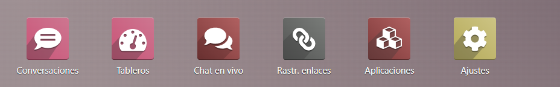
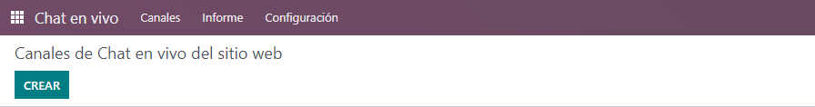
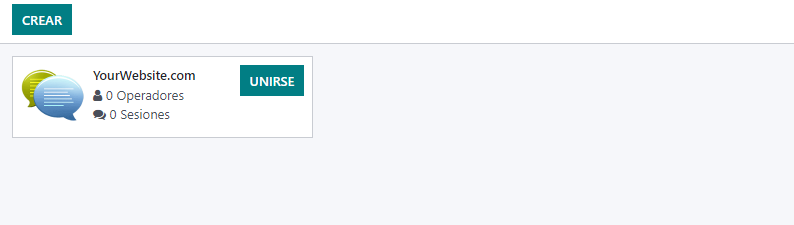
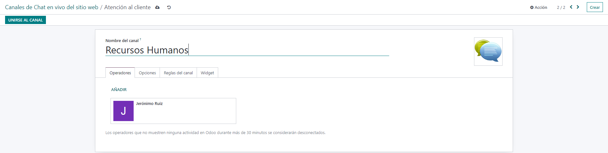
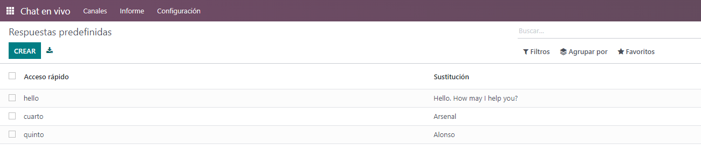
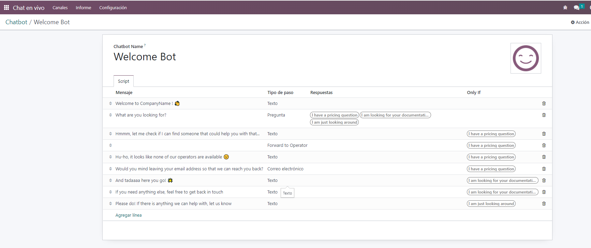
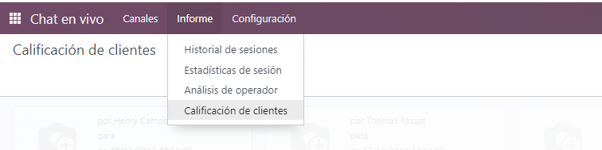
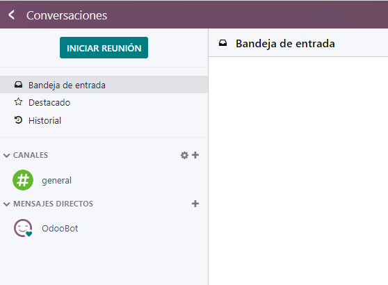

# APLICACIÓN CHAT EN VIVO

## **ÍNDICE**
1. [INTRODUCCION](#introducción)
2. [INSTALACIÓN](#instalación)
3. [EL CHAT](#chat)
   1. [Canales](#canales)
   2. [Crear canal](#crear-canal)
   3. [Configuración](#configuración)
   4. [Informes](#informe)
   5. [Relación entre chat en vivo y conversación](#relación-entre-chat-en-vivo-y-conversación)
4. [Conclusión](#conclusión)

## **INTRODUCCIÓN**
El objetivo de esta aplicación es proporcionar un chat en vivo, como su propio nombre indica, a la empresa, tanto un chat interno para los empleados como un chat con clientes, proveedores... En resumen, un sistema de comunicación directa e instantánea entre los distintos elementos que componen la empresa y la relación de ésta con el exterior.

La aplicación de chat está relacionada con [conversaciones](#relación-entre-chat-en-vivo-y-conversación), como se verá al final.

## **INSTALACIÓN**
Esta aplicación ya viene preinstalada por defecto en el menú de inicio de Odoo. No es necesario hacer nada, salvo pinchar y entrar en el servicio de chat.

Es recomendable iniciar el modo desarrollador (debugger) para configurar los módulos de Odoo, pero en este caso no ofrece más funcionalidades, el aspecto es el mismo prácticamente, aunque sí aporta información sobre el código de distintos botones y acciones.

## **EL CHAT**
### Canales
Al pinchar en la imagen de chat en vivo se accede directamente a la sección de canales, que es la sección principal de la aplicación y a la que se accede por defecto.

Debajo tenemos una lista con los dinstintos canales. El funcionamiento de la aplicación es realmente el de crear canales para distintos usos y la adminsitración de éstos, no tanto las ventanas de conversación en sí, que se gestionan en, sorpresa, la sección de conversaciones. Por defecto hay un canal creado

### Crear canal
Lo primero que vemos al clicar en el botón de crear canal es la ventana de creación de canal, como no podría ser de otra forma. Ahí podemos darle nombre al canal y añadir a los usuarios que gestionan el canal. En el ejemplo hemos creado un canal llamado Recursos Humanos, que estará gestionado por un jefe de Recursos Humanos, y al que se podrán unir los empleados de tal departamento. En el botón añadir se añaden los usuarios, seleccionándolos de una lista de usuarios ya existente, o directamente creando el usuario en el momento.

### Configuración

Dentro de la configuración hay dos pestañas principales. La primera pestaña es la de respuestas predefinidas. Las respuestas predefinidas tienen un nombre, una palabra que activa la respuesta, y luego la respuesta que aparece en el chat.

Esto enlaza con el otro elemento de configuración, el chatbot. Se trata de un conjunto de frases predefinidas y de interacciones automatizadas para que un usuario pueda acceder a cierta información sin necesidad de tener que interactuar con una persona. Por ejemplo, si un cliente necesita de asistencia, podrá elegir de entre una serie de opciones para poder agilizar el trámite antes de que pase el control a un trabajador. En el caso de ejemplo es un bot de bienvenida, con frases de ejemplo para gestionar el trato con un cliente de forma básica. Se pueden añadir frases, o crear bots nuevos para otros fines.

### Informes

La pestaña de informes da acceso a métricas y tablas sobre el funcionamiento de los canales de chat. No es una pestaña para el funcionamiento de los canales en sí, sino datos para el análisis de su funcionamiento, y puede ser ignorado en muchos casos (por ejemplo para un canal de atención al cliente sí sería importante consultar estos datos, pero para un canal de comunicación interno para un departamento en concreto no es tan necesario saber cuántos accesos hay a un canal).

Como se ve en la imagen hay un historial de sesiones (el contenido de las distintas conversaciones en un canal), estadísticas de sesión (cuánto tiempo ha durado la conexión, cuántos usuarios...), análisis de operador (desempeño del usuario en concreto) y calificación de clientes (después de su uso se puede pedir al cliente que valore la transacción, reflejándose en esa pestaña).

### Relación entre chat en vivo y conversación

El módulo de chat en vivo está relacionado con el de conversaciones. Es decir, en el módulo de chat puedes crear canales y añadir a usuarios a esos canales para que puedan comunicarse, y en el módulo de conversaciones se configuran las conversaciones en sí, los parámetros de esas conversaciones, siendo el chat en vivo el marco.

Se puede ver cómo hay una lista de canales, con un buscador de canales (por si hubiera muchos) y una lista de conversaciones directas (puede haber un canal donde haya varios usuarios a la vez, o conversaciones entre dos usuarios directamente). Desde el módulo de conversaciones se puede iniciar directamente una reunión y seleccionar a los usuarios manualmente, pero en casos en los que un grupo de usuarios vayan a reunirse periódicamente o se comuniquen habitualmente es recomendable crear un canal específico para ello. No tendría sentido en una empresa de 100 personas que todo el mundo se comunique a través del chat general, sería un caos. Es más lógico crear distintos canales para los distintos departamentos. Un chat de 20 personas puede ser también un caos, pero significativamente menor que uno de 100.

## Conclusión

El módulo de chat en vivo en un módulo anexo, tangencial para el funcionamiento de una empresa y a la vez fundamental. No es un módulo que vaya a mejorar per se el rendimiento de una empresa, no facilita la gestión de inventario o la gestión de facturas. Los módulos más "principales" por decirlo de una manera de Odoo son los que atraen a los usuarios en primer lugar. Aplicaciones para la gestión de conversaciones hay muchas en el mercado, por lo que una empresa no va a utilizar Odoo sólo por su gestión de conversaciones y canales.

Dicho esto, cualquier usuario de Odoo que instale alguno de los paquetes más importantes, va a tener los módulos de gestión de conversaciones de forma automática. La comunicación dentro de una empresa es muy importante, y la comunicación de la empresa con sus clientes aún más. Claro que hay muchas herramientas de gestión muy populares en el mercado, como Discord o Microsoft Teams. Pero si ya estás usando Odoo, es mucho más cómodo gestionar las conversaciones también con Odoo y no tener una herramienta ajena para ello y el resto con Odoo, mejor para el usuario tenerlo todo junto.

Por lo tanto, si bien no es un módulo que vaya a "vender" Odoo por sí mismo, sí es una herramienta fundamental para prácticamente cualquier usuario de Odoo, sea cual sea el uso que le va a dar al sistema de gestión empresarial en cuestión.

